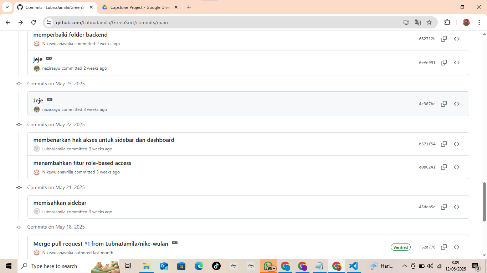
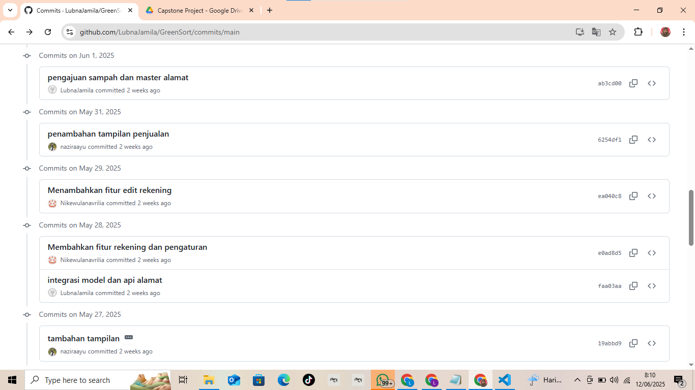
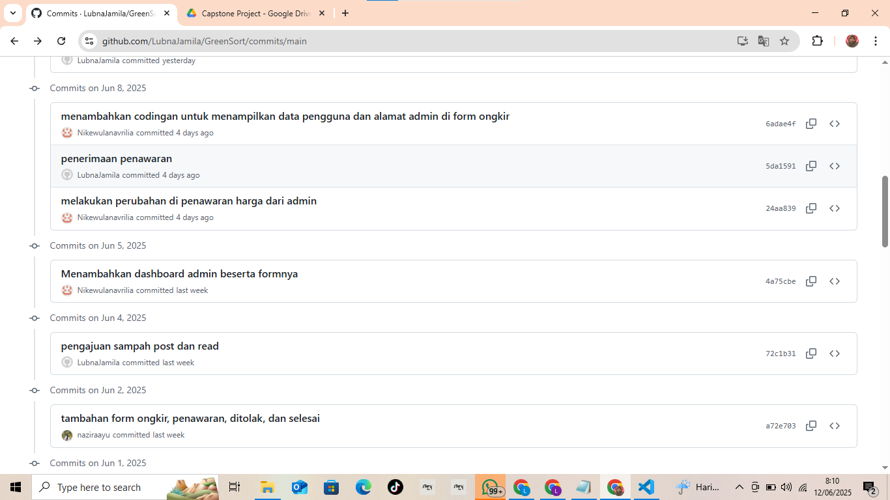
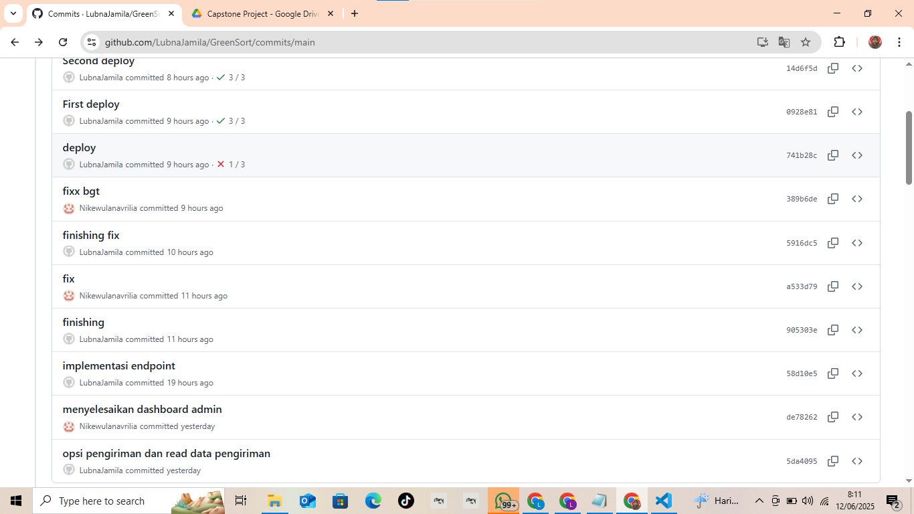

# Changelog

## [1.0.0] - 2025-04-23
- Repository
# 📝 Kontribusi Lubna Jamila untuk Proyek GreenSort

## 📌 Latar Belakang

Selama proses pengembangan proyek ini, saya belum mengatur konfigurasi Git dengan benar, khususnya email Git yang sesuai dengan akun GitHub saya. Akibatnya, commit yang saya lakukan tidak dikenali sebagai kontribusi dari akun GitHub saya, meskipun telah tercatat dalam riwayat commit.

Hal ini baru saya sadari setelah seluruh proses pengembangan selesai. Oleh karena itu, saya membuat file ini sebagai dokumentasi kontribusi yang telah saya lakukan, lengkap dengan bukti visual berupa tangkapan layar commit.

---

## 👩‍💻 Identitas Kontributor

- **Nama**: Lubna Jamila  
- **Peran**: Backend Developer, Frontend Developer, Deployment

---

## 🔧 Deskripsi Kontribusi

Berikut adalah kontribusi yang saya kerjakan dalam proyek ini:

- Pemisahan sidebar berdasarka role akun
- Integrasi model machine learning
- Master Alamat
- Visualisasi dashborad user dengan penerapan tabs navigation dan datatable
- Penerimaan tawaran harga dengan pemilihan opsi pengiriman serta perhitungan ongkir menggunakan longitude dan latitude
- Deploy menggunakan github pages

---

## 🖼️ Bukti Commit

Berikut ini adalah tangkapan layar commit yang saya lakukan selama proyek berlangsung:

---

## ✅ Catatan Tambahan

Untuk ke depannya, saya telah mengatur konfigurasi Git secara benar (`user.name` dan `user.email`) dan memastikan email yang digunakan telah terverifikasi di GitHub agar semua kontribusi saya tercatat dengan baik.

